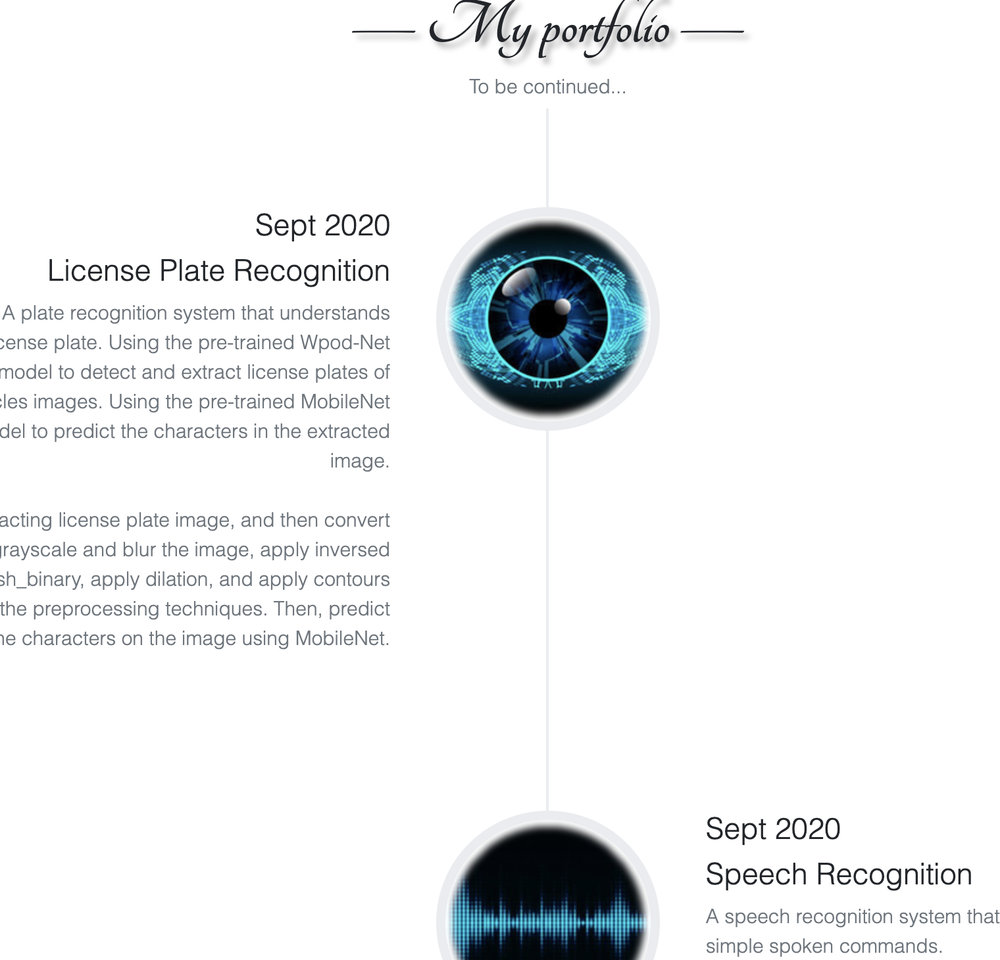
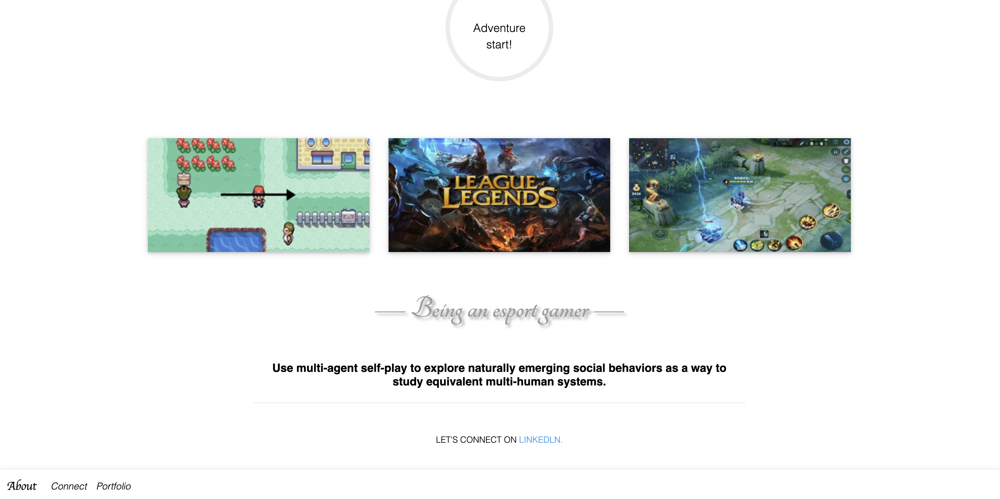

##
<h1 align="center">Profiles</h1>

  
  
  
  

<h2>Preview </h2>

  
  
  

<h2>Dependencies and installation </h2>
<ul> 
  <li>Flask==1.1.2</li>
  <li>gunicorn==20.0.4</li>
</ul>

<h2>Features</h2>
<ul>
  <li>:iphone: **Responsive**</li>
  <li>:gear: **Best Practices**</li>
  <li>:rocket: :rocket: :rocket: </li>
</ul>
